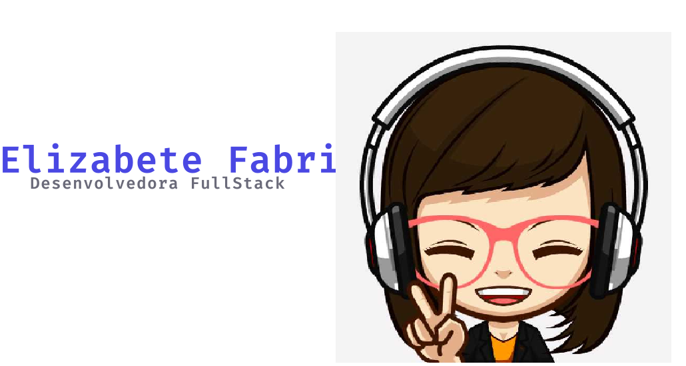

# 🎀 Welcome to my profile 🎀

## Hello World! :wave: :wave:

"Hi there, I'm Elizabete de Sousa, I'm from Brazil. Welcome to my Github profile, I'm a Systems for internet student degree, A lover an also a student of this Software Development World, focused in Front-end Development."

## Languages and Tools:

 
 

## Developing languages:
 

Tecnologias | Experiência |
| - | - |
| HTML, CSS | :star: :star: :star: | 
| Javascript | :star: :star: :star: |
| React.js, Vue.js | :star: :star: :star: |
| Node.js, PHP | :star: :star: :star: |
| React-Native | :star: :star: :star: |

Sobre mim:
- 🔭 Atualmente estou desempregada
- 🌱 Atualmete estou aprendendo: JavaScript, React and NodeJS
- 👯 Sonho em colaborar nos projetos de Impacto Social 
- 🤔 Procuro ajudar pessoas que estão começando na programação.
- 📫 Como chegar até mim: [My Linkedin](https://www.linkedin.com/in/elizabete-fabri-a0927819b/)
- ⚡ Curiosidade: Não tenho nenhum talento especial, apenas sou curiosa.

🚀 "Nada substitui a persistência, nem mesmo o talento." 🚀
